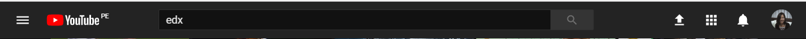
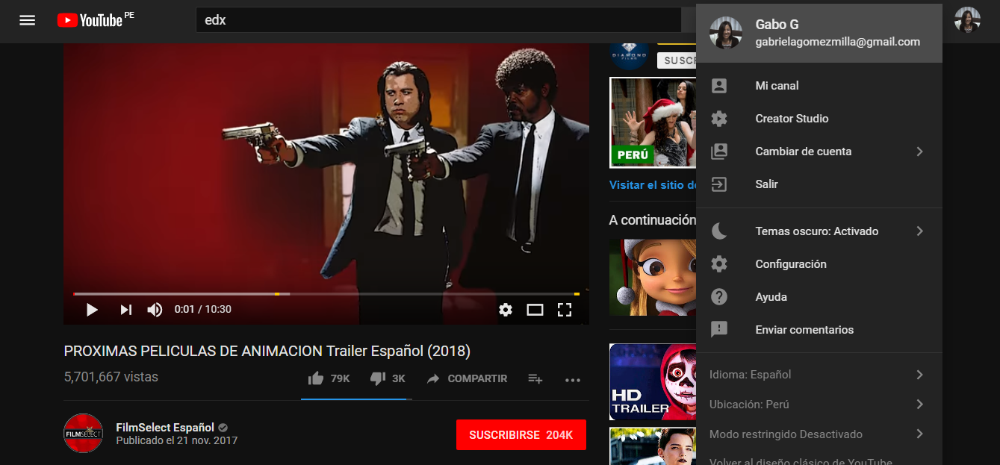
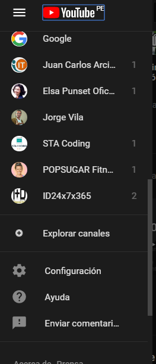
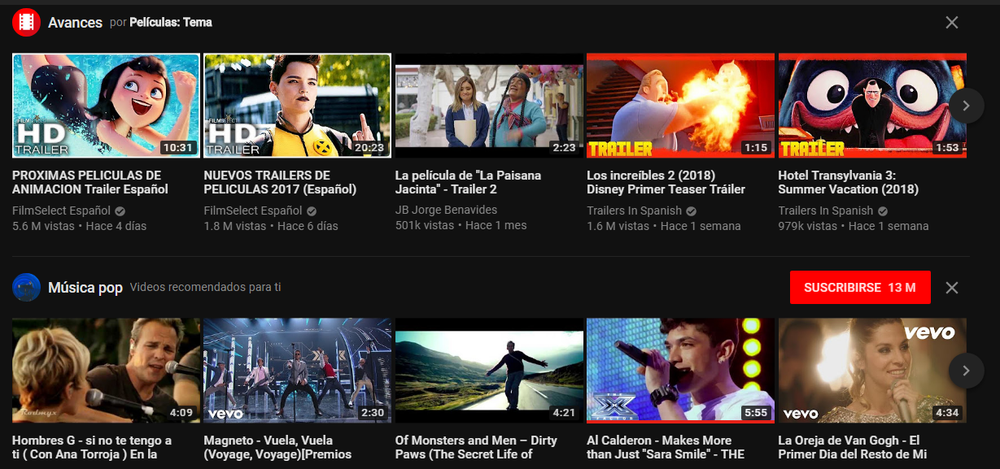
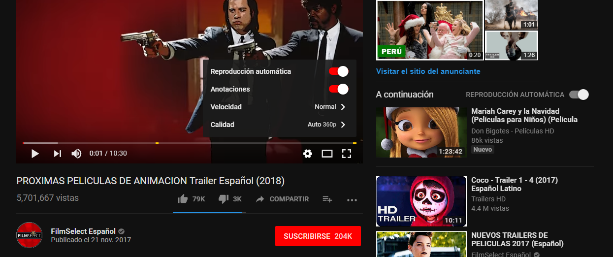

# UX -  UI

## Objetivo

Explicar las partes que conforman el UX y UI de la página web de YouTube.

## Resolución

Para que haya orden al describir tanto los componentes de UX como de UI, decidí  agrupar la página principal en tres partes: sección del menú vertical (se despliega al costado izquierdo), sección menú horizontal superior y la parte principal que es básicamente la del contenido de los vídeos.

**UX :**

1. Habilitación de un menú  vertical que se encuentra presente siempre la navegación, y que me permite de manera rápida:

    * Encontrar videos agrupados por tendencias (lo más popular del momento).
    * Los últimos videos publicados por los canales a los cuales nos hemos suscrito.
    * Me muestra un apartado para poder visualizar todas nuestras subscripciones.
    * Ver el historial de nuestras búsquedas.
    * Ver la lista de vídeos que elegimos ver más tarde.
    * Ver nuestros videos elegidos como favoritos
    * Explorar otros canales (me muestra los más populares agrupados por categorías
    * Tener acceso a la configuración personal.
    * Opción de ayuda.
    En la opción de ayuda al escribir nuestra consulta, el programa me muestra posibles las opciones de temas relacionados a nuestra consulta para poder simplemente seleccionarlas y no molestarnos en continuar escribiendo. También antes de escribir cualquier cosa se nos muestran las opciones de consultas más frecuentes.
    * Envío de comentarios.

2. La habilitación de un menú  horizontal que está presente durante toda  la navegación de las diferentes secciones y que permite :

    * La opción de búsqueda personalizada.
    * La opción de poder recibir notificaciones de los videos más recientes de los canales a los cuales nos hemos subscrito.
    * Subir un video nuevo.
    * La opción de ingresar directamente a Youtube TV, YouTube Gaming, YouTube Music,  Youtube Kids,  Academia de creadores y Youtube para artistas.
    * La habilitación de un menú que da acceso directo.
        -a mi canal.
        -la posibilidad  de crear un canal nuevo, 
        -cambiar de cuenta.
        -salir de Youtube.
        -también me da la opción de cambiar el color del fondo de pantalla ( hay dos opciones : claro y oscuro). 
        -nuevamente la opción de configuración de la cuenta, ayuda y envío de comentarios.

3. En la parte principal de la página de inicio me muestra:

    * Opciones de videos desplazables horizontalmente y que se encuentran agrupados por temas  basados en nuestras búsquedas pasadas más frecuentes y no tan frecuentes pero que alguna vez buscamos.  
    * Muestran los videos  agrupados por categorías, por ejemplo artistas, canciones, géneros de películas, videos subidos recientemente (de alguno de los canales a los cuales nos hemos subscrito), videos que dejamos a medio ver, que ya vimos y que pudiéramos querer volver a ver, etc.
    * Al colocar el cursor sobre cualquier video, se nos muestran los avances del video.

        Al elegir un vídeo de la parte principal de la página de inicio:

        * Nos da la opción de verlo de tres tamaños: el estándar, modo teatro y a pantalla completa. 
        * También la posibilidad de subtítulos y si no está subtitulado que se genere automáticamente.
        * Elegir la calidad de video
        * Elegir la velocidad de reproducción.
        * Posibilidad de hacer anotaciones.
        * Posibilidad de envío del video que estamos viendo por email o a través de otros medios como Facebook, Twitter, etc.
        * Botón para agregar a favoritos o para ver más tarde el video que se encuentra reproduciéndose.
        * También nos muestra la cantidad de likes  y de not-like que el video tiene.
        * Nos muestra de forma clara y llamativa la cantidad de subscritos al canal del video que nos dispongamos a ver.
        * Da la opción a los usuarios de escribir comentarios de los videos que acabamos de ver.
        * También tenemos la opción de ordenar la vista de los comentarios ya escritos por: los más recientes primeros y los principales.
        * Al elegir un video nos muestra también una lista de opciones de videos relacionados al que estamos viendo y que nos pueden interesar. En cada uno de estos videos también tenemos tres opciones (no me interesa, ver más tarde, agregar a la lista de reproducción)
        * También no da la opción de reproducción automática, que es la que el programa genera automáticamente de acuerdo a nuestra búsqueda, y  que también podemos generar agregando videos.

**UI:**

En la parte del menú superior:

* Diseño del menú hamburguesa que desplegará el menú vertical.
* El diseño de tamaño, forma color del buscador.
* La forma y diseño del ícono para subir los vídeos.
* Diseño de ícono para acceso a Youtube TV, YouTube Gaming, YouTube Music,  Youtube Kids,  Academia de creadores y Youtube para artistas.

* Diseño, forma y color de los íconos de las opciones que se muestran al ingresar a la configuración de nuestro canal.

La parte del menú vertical:

* Diseño, forma, color de los íconos, tipo de letra.
* El color que se produce al colocar cursor sobre cada ítem.
* La barra de desplazamiento vertical, para visualizar todo el contenido del menú.

En la parte principal de la página:

* El diseño, forma y color de los íconos de dirección izquierda y derecha (para desplazar los vídeos horizontalmente).
* El diseño, forma y color de los íconos  para las categorías.
* También tipo de letra y  separación.
* Diseño, color, forma de espacio que nos muestra el tiempo de duración de cada video.
* Alto y ancho de los videos, así como también la separación entre ellos.

Al ver un vídeo en particular:

* Diseño, tamaño, color, forma de todos los íconos.
* Tipo de letra, tamaño, color.
* Forma, color y background del botón para subscribirse.
* Barra horizontal que nos va indicando el avance del vídeo.

Los dos colores de elección de background para la página: oscuro y claro.
